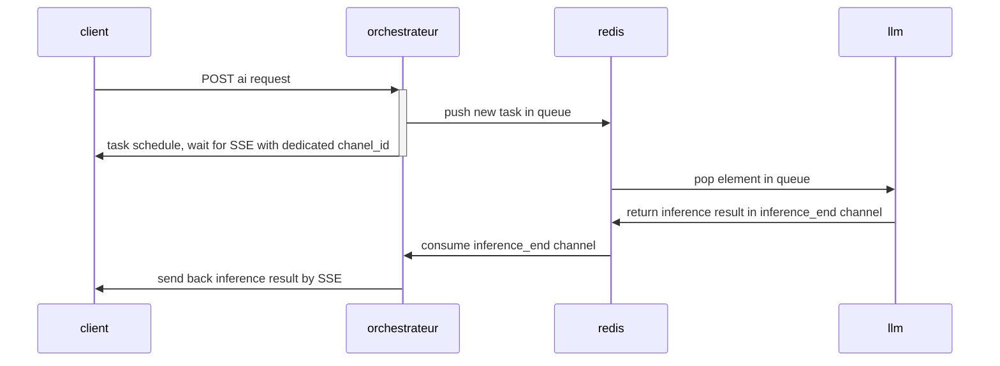

# Test technique LLMOPS

Auteur : Lucas SOVRE

## Sommaire

1. [Description de la stack](#stack)
2. [QuickStart](#quickstart)
    1. [Docker compose](#docker-compose)
    2. [Minikube](#minikube)
3. [Plus de détails](#plus-de-détails)
4. [Pistes d'amélioration](#amelioration)

## Description de la stack :

Pour une bonne orchestration des demandes, nous utilisons Redis list comme message brokers.
Pour permettre au client de récupérer la réponse à sa requête, on utilise le Server Side Event et Redis pub/sub, cela permet de drastiquement réduire le nombre de requêtes, en comparaison avec un refetch régulier.



L'orchestrateur communique également avec une base de donnée mongoDB pour garder une trace des exécutions et permettre de faire des analyses sur leurs KPI.

Avec l'architecture state-less décrite ci-dessous, on peut déployer autant d'orchestrateurs et de workers que nécessaire, nous avons une scalabilité horizontale quasiment infinie :


## QuickStart

Le déploiement de cette stack en presque micro-services peut être complexe. Voici donc les prérequis ainsi que deux manières pour déployer facilement ces services :

#### Prérequis

Le seul prérequis commun est d'avoir un environnement `UNIX`, une ligne de commande `bash` et `docker` d'installé sans avoir à utiliser `sudo`.

Si besoin, voici le tutoriel officiel d'installation de docker : https://docs.docker.com/engine/install/

> Ce readme devrait fonctionner sur Windows, mais n'as pas été testé en dehors d'environnements UNIX.

### Docker-compose

Pour lancer ces services via docker-compose il suffit d'utiliser la commande :

```shell
docker compose up 
```

Vous devriez constater la création des containers (cela peut être assez long à cause des téléchargements des modèles d'IA)

Vous devriez ensuite pouvoir tester les services via http://localhost:8080/docs (spécifications Open-Api de l'orchestrateur)

Vous avez également un notebook python à disposition sous `demo.ipynb`.

### Minikube


## Plus de détails

Pour en savoir plus, rendez vous sur les README des dossiers associés :

- [Llm worker](./llm/README.md)
- [Embbeding worker](./embeding/README.md)
- [Orchestrateur](./orchestrator/README.md)

## Amélioration