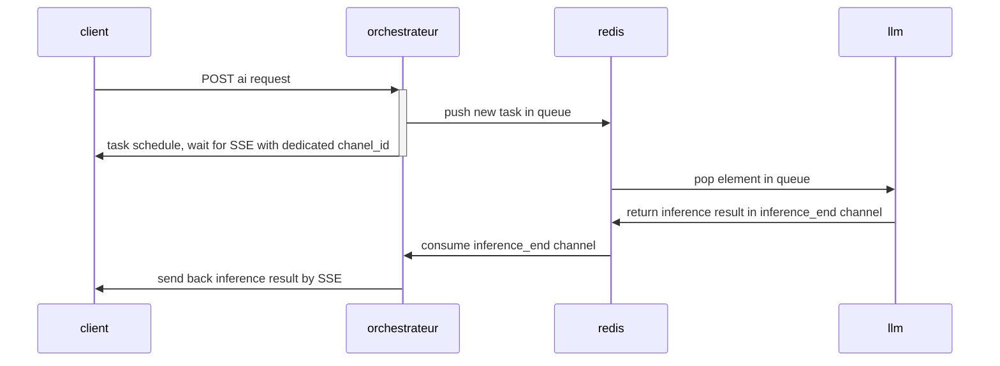
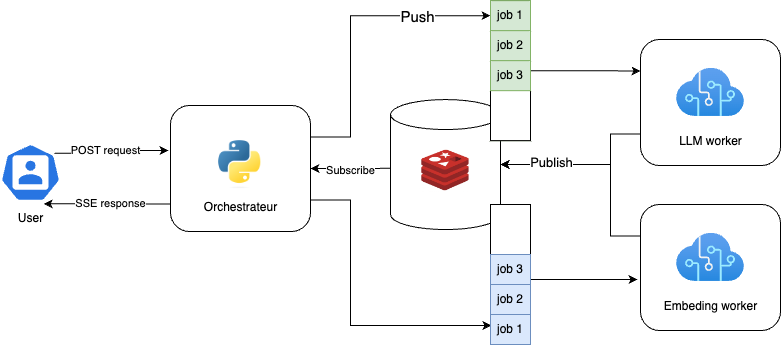

# Test technique LLMOPS

Auteur : Lucas SOVRE

## Sommaire

1. [Description de la stack](#stack)
2. [QuickStart](#quickstart)
    1. [Docker compose](#docker-compose)
    2. [Minikube](#minikube)
3. [Plus de détails](#plus-de-détails)
4. [La CI/CD](#la-cicd)
5. [Pistes d'amélioration](#amelioration)

## Description de la stack :

Pour une bonne orchestration des demandes, nous utilisons Redis list comme message brokers.
Pour permettre au client de récupérer la réponse à sa requête, on utilise le Server Side Event et Redis pub/sub, cela permet de drastiquement réduire le nombre de requêtes, en comparaison avec un refetch régulier.



L'orchestrateur communique également avec une base de donnée mongoDB pour garder une trace des exécutions et permettre de faire des analyses sur leurs KPI.

Avec l'architecture state-less décrite ci-dessous, on peut déployer autant d'orchestrateurs et de workers que nécessaire, nous avons une scalabilité horizontale quasiment infinie :



## QuickStart

Le déploiement de cette stack en presque micro-services peut être complexe. Voici donc les prérequis ainsi que deux manières pour déployer facilement ces services :

#### Prérequis

Le seul prérequis commun est d'avoir un environnement `UNIX`, une ligne de commande `bash` et `docker` d'installé sans avoir à utiliser `sudo`.

Si besoin, voici le tutoriel officiel d'installation de docker : https://docs.docker.com/engine/install/

> Ce readme devrait fonctionner sur Windows, mais n'as pas été testé en dehors d'environnements UNIX.

### Docker-compose

Pour lancer ces services via docker-compose il suffit d'utiliser la commande :

```shell
docker compose up 
```

Vous devriez constater la création des containers (cela peut être assez long à cause des téléchargements des modèles d'IA)

Vous devriez ensuite pouvoir tester les services via http://localhost:8080/docs (spécifications Open-Api de l'orchestrateur)

Vous avez également un notebook python à disposition sous `demo.ipynb`.

### Minikube

Une fois le cluster minikube créé (voir https://kubernetes.io/fr/docs/tasks/tools/install-minikube/)

vous devrez installer helm (un package manager pour kubernetes https://helm.sh/docs/intro/install/)

Deux possibilités :

#### Vous souhaitez build les images docker par vous même ?

Lancer les commandes suivantes :

```shell
bash build_everything.sh 
```

```shell
docker ps
```

Vous devriez constater un container registry en fonctionnement.

Il vous suffit ensuite de vous rendre dans ./helm , puis de lancer :

```shell
helm install my-chart my-chart --values ./example_val.yaml
```

Après quelques instants, vous devriez constater tous vos pods en ligne :

```shell
kubectl get pods
```
 Vous n'avez plus qu'à récupérer le port du nodeport pour essayer en localhost :

```shell
kubectl get svc
```

Exemple :

```
❯ kubectl get svc
NAME                            TYPE        CLUSTER-IP        EXTERNAL-IP   PORT(S)          AGE
kubernetes                      ClusterIP   192.168.194.129   <none>        443/TCP          78m
mongo                           ClusterIP   192.168.194.221   <none>        27017/TCP        17s
orchestrator                    ClusterIP   192.168.194.250   <none>        8080/TCP         17s
redis                           ClusterIP   192.168.194.230   <none>        6379/TCP         17s
orchestrator-nodeport-service   NodePort    192.168.194.169   <none>        8080:31033/TCP   17s
```

Dans cet exemple, nos services sont disponibles sous http://localhost:31033/docs


#### Vous souhaitez utiliser les images issues de la CI/CD github ?

> ATTENTION ces images sont compilées pour processeurs x86

Il vous suffit de vous rendre dans ./helm et de lancer :

```shell
helm install my-chart my-chart
```

Après quelques instants, vous devriez constater tous vos pods en ligne :

```shell
kubectl get pods
```
 Vous n'avez plus qu'à récupérer le port du nodeport pour essayer en localhost :

```shell
kubectl get svc
```

Exemple :

```
❯ kubectl get svc
NAME                            TYPE        CLUSTER-IP        EXTERNAL-IP   PORT(S)          AGE
kubernetes                      ClusterIP   192.168.194.129   <none>        443/TCP          78m
mongo                           ClusterIP   192.168.194.221   <none>        27017/TCP        17s
orchestrator                    ClusterIP   192.168.194.250   <none>        8080/TCP         17s
redis                           ClusterIP   192.168.194.230   <none>        6379/TCP         17s
orchestrator-nodeport-service   NodePort    192.168.194.169   <none>        8080:31033/TCP   17s
```

Dans cet exemple, nos services sont disponibles sous http://localhost:31033/docs


## Plus de détails

Pour en savoir plus, rendez vous sur les README des dossiers associés :

- [Llm worker](./llm/README.md)
- [Embbeding worker](./embeding/README.md)
- [Orchestrateur](./orchestrator/README.md)

## La CI/CD

Une CI/CD est en place, et permet de recréer les images docker à chaque fois qu'un commit modifie son répertoire.

Ces images sont disponibles à : https://github.com/LucasSovre?tab=packages&repo_name=llmops-k8

## Amélioration

Pour avoir des images plus génériques, on pourrait étudier la capacité à monter lesmodèless via des volumes et ne pas avoir à créer une image docker par modèle d'IA.

On pourrait aussi monitorer les utilisations CPU/RAM avec une solution type prometheus.

On pourrait passer d'une exposition nodePort à un ingress plus sécurisé, mais dans le cas d'un exemple simple comme ici, cela serait plus contraignant qu'utile.