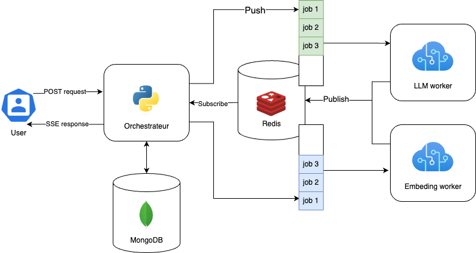

# Test technique LLMOPS

Auteur : Lucas SOVRE

### Description de la stack :

Pour une bonne orchestration des demandes, nous utilisons Redis list comme message brokers.
Pour permettre au client de recuperer la réponse à sa requête, on utilise le Server Side Event et Redis pub/sub, cela permet de drastiquement réduire le nombre de requêtes, en comparaison avec un refetch régulier.

Avec l'architecture state-less décrite ci-dessous, on peut déployer autant d'orchestrateurs et de workers que nécessaire, nous avons une scalabilité horizontale quasiment infinie :

